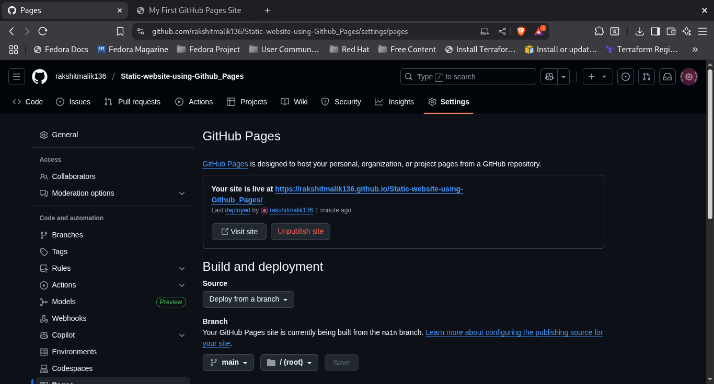
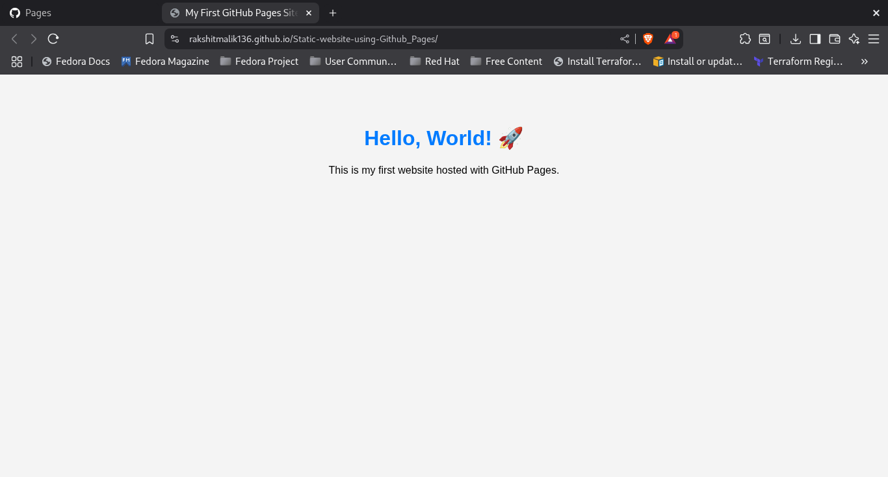

***Task 6 – Host a Static Website with GitHub Pages***
---
Objective
Deploy a simple HTML website using GitHub Pages to understand how to host static content for free.
---
Tools Used
GitHub
GitHub Pages
HTML / CSS (for website content)
---
1) Create a simple HTML and CSS Page
```bash
index.html
style.css
```

2) Push to GitHub

3) Enable GitHub Pages
- Go to your GitHub repository.
- Navigate to Settings → Pages.
- Under Source, select:
- Branch: main
- Folder: / (root)
- Click Save.

4) Access your website
```bash
https://<your-username>.github.io/<your-repo-name>/
```

5) 

6) Screenshots




---
***Key Learnings***
- Hosting static content using GitHub Pages is completely free.
- You can instantly deploy websites directly from your GitHub repository.
- Perfect for portfolios, resumes, and small projects.
- Easy to update — just push changes to the repo
